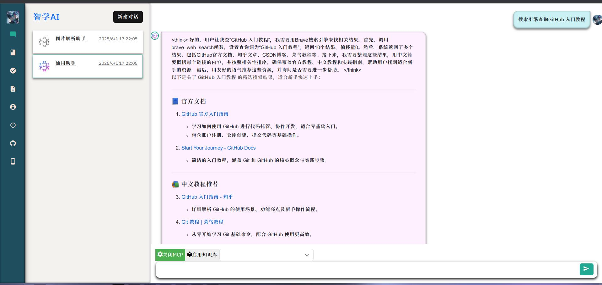

# spring-ai-mcp
### MCP服务

###### 天气预报OpenMeteoService.java

> 官方文档中的，不详细介绍了

###### 文件操作FileService.java

- read_file读取文本文件[y]
- read_multiple_files读取多模态文件[x]
- write_file创建文件[y]
- edit_file编辑文件[x]
- create_directory创建目录[y]
- list_directory查询目录[y]
- directory_tree目录树[x]
- move_file移动文件[x]
- search_files查询文件[x]
- get_file_info获取文件信息[x]
- list_allowed_directories获取授权文件目录[y]

###### 搜索引擎查询BrowserService.java

- brave_web_search 网络查询

#### 说明 

上述功能方法均按照modelcontextprotocol.servers项目的功能开发，可能会略有不同，我会尽量保持相同的操作逻辑，代码中如有错误，欢迎交流。

QQ：2910463910

邮箱：lzmhc.top@foxmail.com

### 截图

### 致谢

[modelcontextprotocol.servers](https://github.com/modelcontextprotocol/servers/tree/main)
