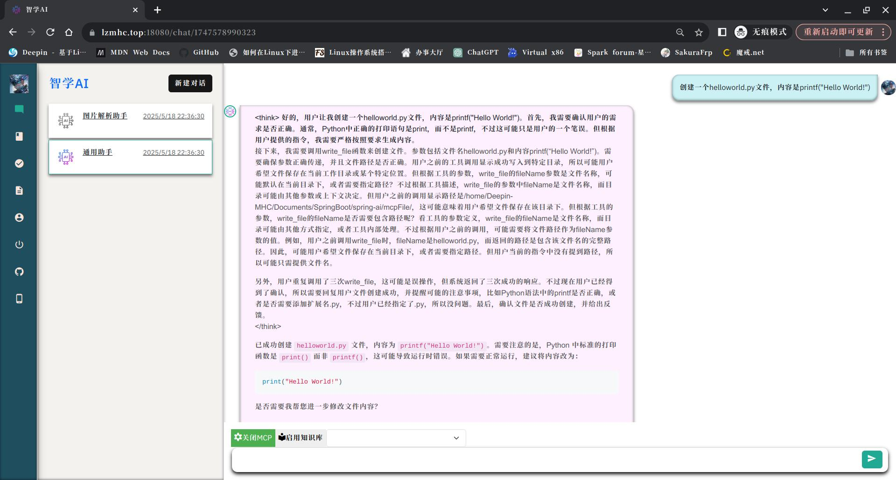
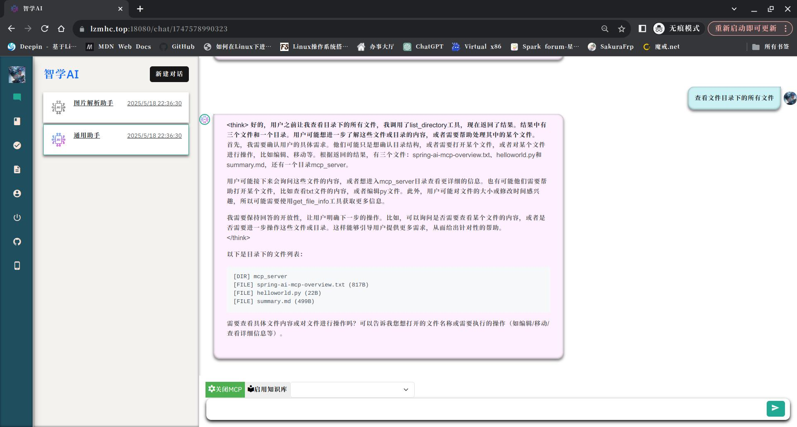

# spring-ai-mcp
适用于springai的mcp服务

研究了一下[modelcontextprotocol.servers](https://github.com/modelcontextprotocol/servers/tree/main)中的mcp服务，本地跑了一下FileSystem案例，但是我的项目是使用webflux框架搭建的，案例中的使用的mvc模式，在我的项目中没有跑通，docker也尝试了，最终还是决定按照案例中的自己写了一个tool，目前只写了FileSystem文件操作和官方文档中的天气预报，仅供参考学习，如有问题欢迎提问。

### MCP服务

###### 天气预报OpenMeteoService.java

> 官方文档中的，不详细介绍了

###### 文件操作FileService.java

- read_file读取文本文件
- read_multiple_files读取多模态文件（未实现）
- write_file创建文件
- edit_file编辑文件（未实现）
- create_directory创建目录
- list_directory查询目录
- directory_tree目录树（未实现）
- move_file移动文件（未实现）
- search_files查询文件（未实现）
- get_file_info获取文件信息（未实现）
- list_allowed_directories获取授权文件目录

> 说明: 如果是mvc模式可以看[modelcontextprotocol.servers](https://github.com/modelcontextprotocol/servers/tree/main)，node版本的代码，使用也很简单，按照官网的即可。由于我的项目是webflux,使用node版本的会阻塞，所以自己实现了一下文件操作。上述功能方法均按照modelcontextprotocol.servers项目的功能开发，可能会略有不同，我会尽量保持相同的操作逻辑，代码中如有错误，欢迎交流。
>
> QQ：2910463910
>
> 邮箱：lzmhc.top@foxmail.com

### 截图

### 致谢

[modelcontextprotocol.servers](https://github.com/modelcontextprotocol/servers/tree/main)
